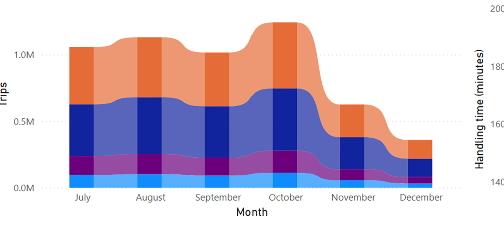
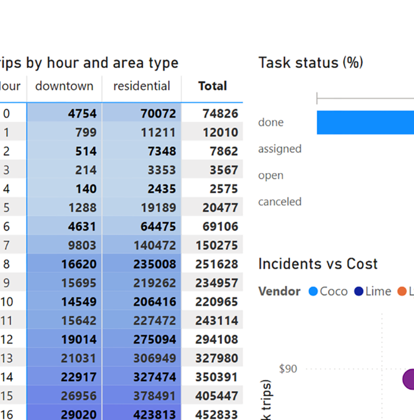
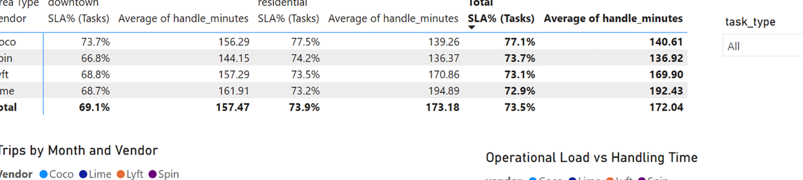
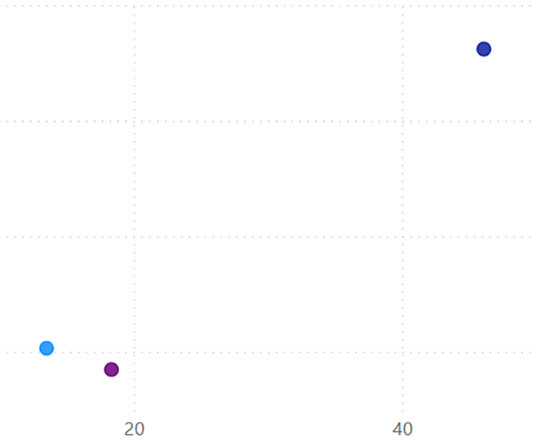
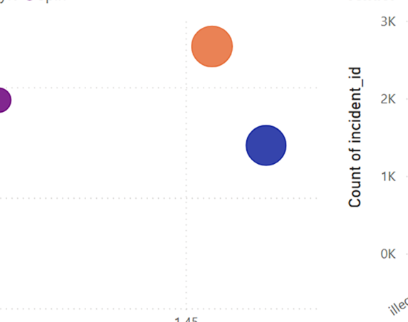
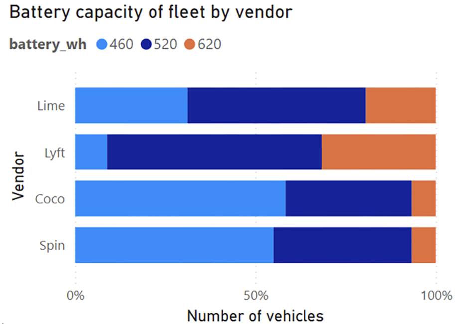

# Chicago Micromobility - Synthetic MDS Project

> **Goal:** Build a realistic, dynamic micromobility dataset (MDS-style tables) from public **Chicago e-scooter trips** to analyze vendor competition, operations, safety, and costs — end-to-end from data generation → ETL → Power BI reporting.

---

## Why this project
This project was borne out of a lack of access to real vendor data in my desire to analyse the micromobility industry with a focus on realistic and dynamic figures. After searching for comprehensive datasets on micromobility to no avail, I decided to script my own synthetic MDS datasets using the *e-scooter trips* data from the City of Chicago’s data portal as a baseline. I created 7 different Python scripts for 7 tables — **hourly_demand**, **incidents**, **status_changes**, **tasks**, **vehicles**, **pricing_policies**, and **service_areas**. The locations were extracted from the original Chicago data to preserve authenticity. The output was exported as CSV files, which I then loaded into a local **PostgreSQL** database for ETL, queried with SQL to shape smaller analytical extracts, and finally modeled and visualized in **Power BI**.


---

## Synthetic table generators (Python)

All generators target **Python 3.9+** and use **pandas / numpy** (optional: **pyarrow** for speed). Each script is **deterministic** given a seed and is designed to be **dynamic (non-flat)** while staying **joinable** to the baseline trips.

> The project started with a single `generate_mds_ops.py` and evolved into focused, zero-setup scripts so you can iterate on one table while working with the others in Power BI.

### 1) `generate_hourly_demand.py`
- **Inputs:** `e_scooter_trips.csv` (auto-detected), optional `service_areas.csv`
- **Output:** `hourly_demand_by_vendor.csv`
- **What it does:** aggregates trips into **day × hour × service_area × vendor**, calibrates vendor mix by month, adds hour-of-day and area-type shapes, and injects realistic noise (negative-binomial/Poisson).  
- **Join keys:** `day, hour, service_area_id, vendor`

### 2) `generate_incidents.py`
- **Inputs:** `hourly_demand_by_vendor.csv`, optional `vehicles.csv`
- **Output:** `incidents.csv`
- **Features:** incident types (`battery_failure, crash, illegal_parking, vandalism`), realistic severities, **occurred_at / resolved_at**, **resolution**, cost proxy, and per-hour linkage back to demand.  
- **Join keys:** `day, hour, service_area_id, vendor, vehicle_id` (vehicle optional)

### 3) `generate_status_changes.py`
- **Inputs:** `hourly_demand_by_vendor.csv`, optional `vehicles.csv`
- **Output:** `status_changes.csv`
- **Features:** `battery_low, rebalance, offline, maintenance, deployment, retrieval` with **handle_minutes**, **sla_minutes**, **sla_met_int (0/1)**, **workload_trips_hour**, **cost_usd**, **hour_band**, `weekday`.  
- **Join keys:** `day, hour, service_area_id, vendor, vehicle_id`

### 4) `generate_tasks.py` (with progress logs)
- **Inputs:** `hourly_demand_by_vendor.csv`, optional `incidents.csv`, `status_changes.csv`, `vehicles.csv`, `service_areas.csv`
- **Output:** `tasks.csv`
- **Features:** `battery_swap, rebalance, pickup_illegal_parking, repair`; contains **created_at/assigned_at/completed_at**, **response_minutes / work_minutes / total_minutes**, **sla_target_min**, **sla_met_int**, **priority**, assignee/team, **cost_usd + parts_cost_usd**, **workload_trips_hour**, links to incidents/status (`linked_incident_id / linked_event_id`).  
- **Progress:** Logs scope, two-pass generation (linked then proactive), periodic row counts, final SLA summaries.  
- **Join keys:** `day, hour, service_area_id, vendor` (optionally `vehicle_id` via links)

### 5) `generate_vehicles.py`
- **Inputs:** `hourly_demand_by_vendor.csv` (calibrates fleet size & distribution)
- **Output:** `vehicles.csv`
- **Features:** **vehicle_id**, `vendor`, `in_service_since`, `battery_wh`, **odometer_km** (utilization proxy), `status` (`active/maintenance`), `service_area_id_home / community_area_name_home` for deployment geography.

### 6) `generate_pricing_policies.py`
- **Output:** `pricing_policies.csv`
- **Features:** vendor-monthly `base_fare, per_minute, per_km` with gentle randomization (for elasticity exploration).

### 7) `generate_service_areas.py`
- **Output:** `service_areas.csv`
- **Features:** derives unique area names from trips or codes; classifies to **area_type** (`downtown, residential`) with simple rules.

---

## Repro: quick start

```bash
# 1) Create/activate venv (optional)
python3 -m venv .venv && source .venv/bin/activate

# 2) Install deps
pip install -U pandas numpy pyarrow

# 3) Put the scripts next to your Chicago trips CSV
#    (or update paths inside scripts if you prefer a /scripts folder)

# 4) Generate tables (one at a time)
python3 generate_hourly_demand.py
python3 generate_vehicles.py
python3 generate_incidents.py
python3 generate_status_changes.py
python3 generate_tasks.py
python3 generate_pricing_policies.py
python3 generate_service_areas.py
```

> **Tip:** Each script auto-detects `e_scooter_trips.csv`. Most have quick-mode switches and progress logs to speed up iteration.

---

## Data model & join keys

```
           ┌────────────┐
           │  Vendor    │
           └─────┬──────┘
                 │
┌────────────┐   │    ┌──────────────────────────┐
│  Date      │───┼────│ hourly_demand_by_vendor │
└────┬───────┘   │    └──────┬─────────┬────────┘
     │           │           │         │
┌────▼──────┐ ┌──▼───┐   ┌───▼────┐ ┌──▼──────────┐
│   Hour    │ │Areas │   │Incidents│ │StatusChanges│
└───────────┘ └──┬───┘   └────┬────┘ └─────┬───────┘
                 │            │            │
               ┌─▼────────────▼────────────▼─┐
               │           Tasks             │
               └─────────────────────────────┘
                          │
                     ┌────▼────┐
                     │Vehicles │
                     └─────────┘
```

**Core keys:**

- All fact tables carry `day, hour, service_area_id, vendor` for alignment.
- `service_areas[service_area_id]` relates to facts; `area_type` used for slicing.
- `vehicles[vehicle_id]` relates to incidents/status/tasks where present.
- `pricing_policies` joins by `vendor` + month.

---

## ETL to PostgreSQL

Load CSVs to staging, then shape analytics tables.

```sql
-- Example: staging
CREATE SCHEMA IF NOT EXISTS staging;

CREATE TABLE IF NOT EXISTS staging.hourly_demand_by_vendor (
  day date, hour int, service_area_id int, community_area_name text,
  vendor text, trips int, vendor_day_total int,
  share_within_day numeric, share_within_vendor_day numeric
);

-- Repeat for incidents, status_changes, tasks, vehicles, service_areas, pricing_policies
-- Use \copy in psql or your favorite loader

-- Example extracts: monthly vendor KPIs
CREATE MATERIALIZED VIEW analytics.vendor_monthly AS
SELECT date_trunc('month', day) AS month,
       vendor,
       SUM(trips) AS trips,
       SUM(cost_incidents) AS cost_incidents,    -- join from incidents aggregate
       SUM(cost_tasks) AS cost_tasks             -- join from tasks aggregate
FROM (
  SELECT day, vendor, SUM(trips) AS trips, 0 AS cost_incidents, 0 AS cost_tasks
  FROM staging.hourly_demand_by_vendor
  GROUP BY 1,2
) d
GROUP BY 1,2;
```

> In practice, I used a mix of SQL views/materialized views for monthly/area/vendor cuts to feed smaller CSVs into Power BI.

---

## Power BI model (minimal DAX)

**Dimensions:** Date, Hour (0–23), Vendor, Service Areas (with `area_type`)  
**Facts:** hourly_demand_by_vendor, incidents, status_changes, tasks, vehicles

**Key measures (tiny):**
```DAX
Trips := SUM('hourly_demand_by_vendor'[trips])
Incidents := COUNT('incidents'[incident_id])
Status Events := COUNT('status_changes'[event_id])
Tasks := COUNT('tasks'[task_id])
Incidents per 1k Trips := DIVIDE([Incidents], [Trips]) * 1000
Tasks per 1k Trips := DIVIDE([Tasks], [Trips]) * 1000
SLA% (Tasks) := AVERAGE('tasks'[sla_met_int])  -- 0/1 column; format as %
Task Cost (Ops+Parts) := SUM('tasks'[cost_usd]) + SUM('tasks'[parts_cost_usd])
```

**Report pages (highlights):**
- **Vendor Analysis:** vendor share over time, SLA% by vendor/type, risk vs spend scatter (Incidents/1k vs Cost/1k), cost heatmap (Hour × Area Type)
- **Demand & Utilization:** Trips over time, Hour × Area Type heatmap with per-column normalization
- **Incidents & Safety:** incidents by type/vendor; resolution time distribution; cost waterfall
- **Status Changes (Ops):** handle_minutes vs workload; SLA% by event_type
- **Tasks & Workforce:** funnel (status), SLA by task_type & vendor, ops speed vs cost
- **Fleet (Vehicles):** status mix, battery_wh mix, odometer distribution, incidents per 10k km; vehicle drill-through

**Maps:** Use either:
- `Location = community_area_name & ", Chicago, IL, USA"` (Data category: Address), or
- centroid **Latitude/Longitude** for each area (preferred; no geocoding ambiguity).

---

## Insights

Below are the key takeaways from the Power BI report using six representative visuals.

### 1) Demand & vendor share over time
<p align="center">
  
</p>

- Clear seasonality with a late-summer/early-autumn peak, softening into winter.
- Vendor mix remains competitive with only gradual rotation month-to-month.

### 2) When & where people ride (hour × area type)
<p align="center">
  
</p>

- Downtown concentrates trips in morning/evening commuting bands; residential areas skew to midday and evening.
- The pattern holds across vendors, indicating consistent citywide behavior.

### 3) Ops quality by place (SLA% & handling minutes)
<p align="center">
  
</p>

- SLA% (share of tasks within target) sits in the low-to-mid-70s overall.
- Handling minutes vary by vendor and area type, suggesting different crew footprints or routing efficiency.

### 4) Operational load vs speed
<p align="center">
  
</p>

- As average trips per hour rise, handling time tends to increase (congestion/queueing effect).
- Points farther above the trend indicate opportunities to rebalance staffing or staging.

### 5) Risk vs spend (incidents/1k vs cost/1k)
<p align="center">
  
</p>

- Incident rates per 1k trips cluster tightly, but **cost per 1k** diverges—some vendors spend more to achieve similar risk.
- Best-in-class quadrant: lower incident rate **and** lower cost per 1k.

### 6) Fleet capability mix (battery capacity)
<p align="center">
  
</p>

- Battery-capacity distributions differ by vendor (e.g., heavier 620Wh share vs lighter packs).
- This mix explains parts of the operational profile (range, swap frequency, and task load).

---

## Data dictionary (abridged)

- **hourly_demand_by_vendor**: `day, hour, service_area_id, community_area_name, vendor, trips, share_within_day, share_within_vendor_day`
- **incidents**: `incident_id, vendor, vehicle_id, occurred_at, resolved_at, incident_type, severity, service_area_id, community_area_name, resolution, cost_usd, hour_band, weekday`
- **status_changes**: `event_id, vendor, vehicle_id, occurred_at, event_type, handle_minutes, sla_minutes, sla_met_int, service_area_id, community_area_name, workload_trips_hour, cost_usd, hour_band, weekday`
- **tasks**: `task_id, vendor, task_type, task_subtype, priority, status, created_at, assigned_at, completed_at, response_minutes, work_minutes, total_minutes, sla_target_min, sla_met_int, deadline_at, service_area_id, community_area_name, hour_band, weekday, assigned_to, team, source, linked_incident_id, linked_event_id, cost_usd, parts_cost_usd, workload_trips_hour`
- **vehicles**: `vehicle_id, vendor, in_service_since, battery_wh, odometer_km, status, service_area_id_home, community_area_name_home`
- **service_areas**: `service_area_id, community_area_name, area_type`
- **pricing_policies**: `vendor, start_date, end_date, base_fare, per_minute, per_km`

---

## Repro tips & performance
- Install **pyarrow** to speed CSV I/O: `pip install pyarrow`
- Keep intermediate CSVs outside the repo or add to `.gitignore`
- For iteration, restrict date windows in scripts (e.g., last 60 days) then scale up
- Use **progress logs** to monitor long runs (especially tasks generator)

---

## Caveats
- This is **synthetic** data: realistic but not real. It should be used for methods, prototypes, and portfolio work — **not** for operational or policy decisions.
- Vendor names and shares are simulated; any resemblance to reality is coincidental.

---

## License & attribution
- Chicago e-scooter trips: see the City of Chicago’s portal for terms.
- Code & synthetic outputs in this repo: MIT (adjust as you prefer).
- Maps/geocoding in Power BI: Bing/Azure Maps terms apply.

---

## Contact
Questions or ideas to extend (e.g., elasticity vs pricing, weather integration, event overlays)? Open an issue or reach out.
